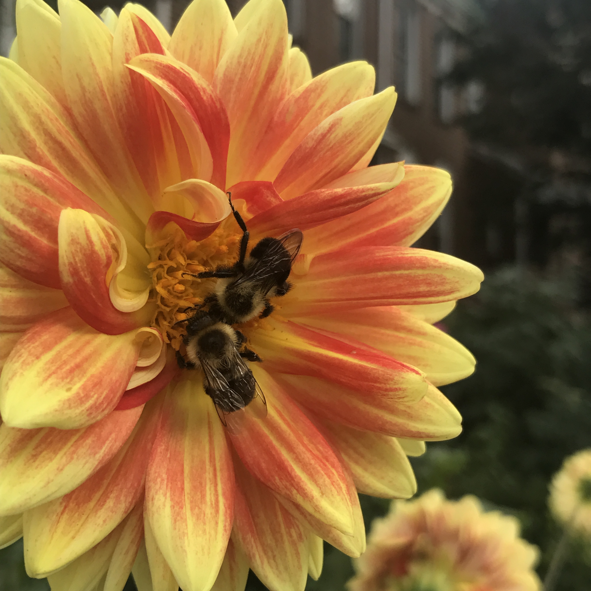
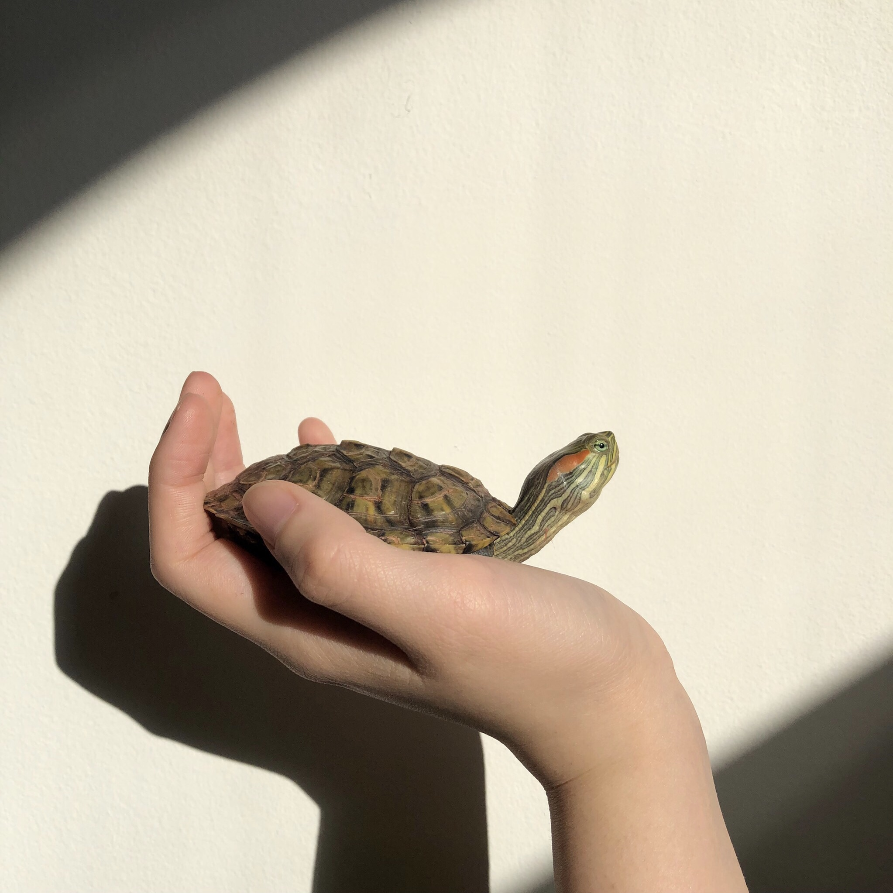
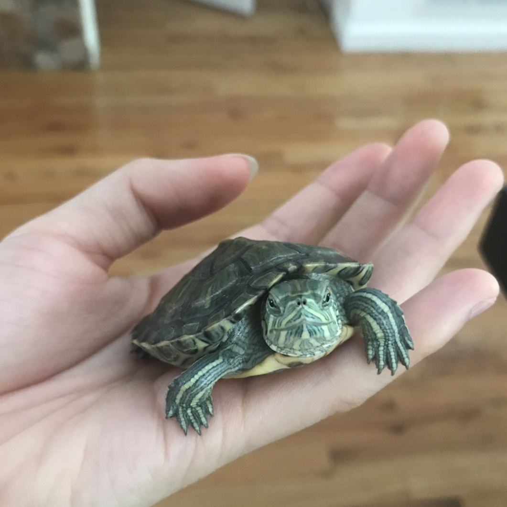

# picturegram<!DOCTYPE html>
<html>
<head>
	<title>Picturegram</title>

	<link href="https://fonts.googleapis.com/css?family=Lobster" rel="stylesheet">

	
	
</head>
<body>
<h1>Picturegram</h1>

 
 

</body>
</html>
